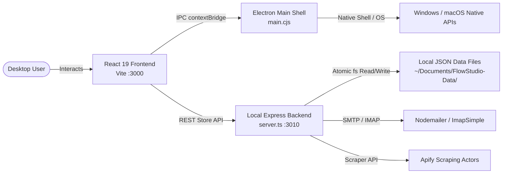
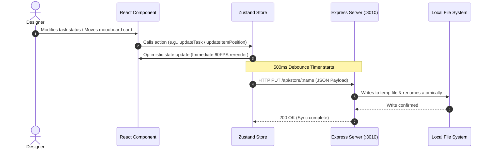

# 🏛️ System Architecture

### Flow Studio – Local-First Desktop Creative & Productivity Suite
This document describes the overall system architecture, technology stack, folder structure, data flow, and key design decisions for the Flow Studio application.

---

### Table of Contents
1. [High-Level Architecture](#1-high-level-architecture)
2. [Technology Stack](#2-technology-stack)
3. [Folder Structure](#3-folder-structure)
4. [Data Flow](#4-data-flow)
5. [Database & Local Storage Schema](#5-database--local-storage-schema)
6. [Key Architectural Decisions](#6-key-architectural-decisions)
7. [Security Considerations](#7-security-considerations)
8. [Scalability & Future Plans](#8-scalability--future-plans)
9. [External Services](#9-external-services)
10. [Environment Setup](#10-environment-setup)
11. [Summary](#11-summary)

---

## 1. High-Level Architecture

Flow Studio follows a modern full-stack hybrid desktop architecture using React 19, TypeScript, Electron, and an Express micro-service backend.

```
┌─────────────────┐       HTTP / WS        ┌──────────────────┐
│      User       │ ◄────────────────────► │  Vite Frontend   │
│ (Desktop Shell) │                        │ (React 19 / UI)  │
└────────┬────────┘                        └────────┬─────────┘
         │                                          │
         │ contextBridge IPC                        │ REST / Fetch (:3010)
         ▼                                          ▼
┌─────────────────┐                        ┌──────────────────┐
│  Electron Main  │ ◄────────────────────► │  Express Server  │
│   (main.cjs)    │   Process Management   │   (server.ts)    │
└────────┬────────┘                        └────────┬─────────┘
         │                                          │
         │ Native Shell / Drives                    │ Atomic fs/promises
         ▼                                          ▼
┌─────────────────────────────────────────────────────────────┐
│                   Local Storage & Disk                      │
│     ~/Documents/FlowStudio-Data/ (*.json) & %APPDATA%       │
└─────────────────────────────────────────────────────────────┘
```



---

## 2. Technology Stack

Technologies used in the project and their specific purpose:

| Layer | Technology | Purpose |
|:---|:---|:---|
| **Frontend Framework** | React 19.0.0 | Core UI rendering engine and component hierarchy |
| **Language** | TypeScript 5.8.2 | End-to-end type safety and developer ergonomics |
| **Styling** | Tailwind CSS 4.1.14 | Utility-first styling, CSS tokens, responsive layouts |
| **Icons** | Lucide React & Material Symbols | Visual iconography across all toolbars and navigation |
| **Desktop Shell** | Electron 43.1.0 | Native cross-platform desktop wrapper & window manager |
| **Local Backend** | Express 4.21.2 | Local REST API server on port 3010 for file writes & mail |
| **State Management** | Zustand 5.0.13 | High-performance modular reactive stores with persistence |
| **Canvas Engine** | `react-moveable` + `react-selecto` | Hardware-accelerated 2D drag, resize, rotate, and marquee |
| **Drawing Subsystem** | Custom SVG + `@tldraw/tldraw` | Freehand vector stroke rendering and smoothing |
| **Database / Storage** | Local JSON File System | 100% private, human-readable data stores in user Documents |
| **Email Transport** | `nodemailer` & `imap-simple` | Outbound SMTP sending and inbound IMAP mail parsing |
| **Export Engines** | `html2pdf.js` & `html2canvas-pro` | High-fidelity client-side PDF invoice generation |
| **Data Visualization**| Recharts 3.9.2 | Activity graphs, pipeline forecasting, and KPI metrics |
| **Build & Tooling** | Vite 6.2.0 & esbuild 0.28.1 | Instant hot module replacement (HMR) and fast bundling |

---

## 3. Folder Structure

The project follows a feature-based folder structure to keep the code organized and scalable:

```text
Flow-Studio/
├── main.cjs                           # Electron Main process (Window management & IPC)
├── preload.cjs                        # Electron Preload script (contextBridge isolation)
├── server.ts                          # Local Express micro-backend (port 3010)
├── index.html                         # Application HTML root shell
├── package.json                       # Dependencies, compilation matrix & packaging config
├── tailwind.config.js                 # Tailwind CSS design system rules
├── tsconfig.json                      # TypeScript strict compiler configuration
├── vite.config.ts                     # Vite build configuration & server proxies
├── Docs/                              # Comprehensive project documentation
│   ├── PRD.md                         # Product Requirements Document
│   ├── ARCHTECTURE.md                 # System Architecture Blueprint
│   ├── RULES.md                       # Engineering & AI Agent rules
│   ├── DESIGN.md                      # Design System & UI specifications
│   ├── TASK.md                        # Task breakdown & progress roadmap
│   └── MEMORY.md                      # Project memory, decisions & known quirks
├── public/                            # Static icons, splash screen, and logos
├── scripts/                           # Build and packaging automation scripts
│   ├── build-server.cjs               # esbuild script compiling server.ts to CJS
│   └── package-app.cjs                # Windows standalone desktop packager
└── src/                               # Application source code
    ├── main.tsx                       # React DOM entry point
    ├── App.tsx                        # Main state-based view router & command palette
    ├── index.css                      # Global Tailwind styles & 5px custom scrollbars
    ├── types.ts                       # Shared TypeScript domain interfaces
    ├── components/                    # Modular feature-based UI components
    │   ├── Auth/                      # Local user profile & authentication
    │   ├── Billing/                   # Invoices, ledger, payments, and PDF exports
    │   ├── BlockEditor/               # Brand style & layout testing playground
    │   ├── Calendar/                  # Visual milestone & task calendar
    │   ├── Clients/                   # CRM directory, 3-step wizard, client workspaces
    │   ├── Dashboard/                 # KPI metrics, Recharts graphs, renewal lists
    │   ├── Data/                      # Data backup, JSON exports & recycle bin
    │   ├── GlobalComponents/          # Reusable shared UI primitives
    │   │   ├── CommandPalette/        # Spotlight search modal (Ctrl+K)
    │   │   ├── FileExplorer/          # Windows-grade tabbed file explorer
    │   │   ├── Pages/TaskPage/        # ClickUp-style high-density task grid
    │   │   ├── Modals/                # Confirmation, upload, and prompt dialogs
    │   │   └── ToastContainer.tsx     # 60FPS dynamic notification stack
    │   ├── Leads/                     # Leads CRM table, Apify generator, cold emails
    │   ├── Projects/                  # Portfolio overview & ProjectDetailsLayout
    │   │   └── ProjectDetails/
    │   │       ├── Files/             # Project asset manager
    │   │       ├── MoodboardPage/     # Infinite canvas vector editor
    │   │       ├── NotesPage/         # Rich text meeting notes editor
    │   │       └── OverviewPage/      # Velocity metrics & Completion Coefficient
    │   ├── Reports/                   # Agency financial and velocity analytics
    │   ├── Settings/                  # Workspace preferences & DevSettingsWorkspace
    │   ├── Sidebar/                   # Cal.com-inspired main navigation sidebar
    │   ├── Team/                      # Team member directories, roles & rates
    │   └── Time/                      # Billable project stopwatch tracker
    ├── context/                       # Global React Context providers
    │   └── SettingsContext.tsx        # System appearance and theme provider
    ├── hooks/                         # Custom React hooks
    ├── stores/                        # Zustand stores with debounced persistence (24 slices)
    │   ├── projectStore.ts            # Projects, templates, milestones
    │   ├── taskStore.ts               # Tasks, custom columns, priorities
    │   ├── moodboardStore.ts          # Canvas items, pan/zoom coordinates
    │   ├── clientStore.ts             # Corporate clients & brand kit palettes
    │   ├── leadStore.ts               # Inbound leads & pipeline forecasting
    │   ├── billingStore.ts            # Invoices, receivables, and transactions
    │   ├── devStore.ts                # Developer diagnostics & hidden hitbox flags
    │   └── toastStore.ts              # 60FPS notification queue
    └── utils/                         # Mathematical & formatting helper utilities
        ├── colorUtils.ts              # Color conversions (HEX/RGB/HSL) & contrast
        ├── drawingUtils.ts            # Smooth SVG path calculation algorithms
        └── fileIcons.ts               # File extension to Lucide icon mappers
```

---

## 4. Data Flow

The data flow within Flow Studio ensures immediate optimistic UI updates while preserving asynchronous atomic disk writes:



1. **User Action:** The user updates a task priority or repositions an image card on the infinite canvas.
2. **Optimistic Store Update:** The corresponding Zustand store updates its reactive memory state instantly; React rerenders the component in sub-16ms.
3. **Debounced Disk Sync:** Store middleware intercepts the change, debounce-timers for 500ms, and dispatches an HTTP PUT request to `http://localhost:3010/api/store/:name`.
4. **Atomic Write Guarantee:** The Express backend receives the payload, verifies JSON integrity, writes to a temporary buffer file, and flushes to the permanent location in `~/Documents/FlowStudio-Data/` to prevent partial write corruptions.

---

## 5. Database & Local Storage Schema

All core business entities are modeled as strongly typed JSON arrays:

### 5.1 Project Schema (`projects.json`)
```typescript
interface Project {
  id: string;                          // "proj-1726819200-abc"
  name: string;                        // "Fintech Mobile Rebrand"
  title?: string;
  clientId: string;                    // Foreign key -> clients.json
  category: string;                    // "Brand Identity", "UI/UX"
  status: 'active' | 'review' | 'draft' | 'completed' | 'archived';
  progress: number;                    // 0 to 100 (Dynamic Completion Coefficient)
  deadline: string;                    // "2026-10-15"
  tags: string[];                      // ["Mobile", "Fintech", "Design System"]
  brandColors?: string[];              // ["#111111", "#3b82f6", "#10b981"]
}
```

### 5.2 Task Schema (`tasks.json`)
```typescript
interface Task {
  id: string;                          // "task-1726819200-xyz"
  projectId: string;                   // Foreign key -> projects.json
  title: string;                       // "Design High-Fidelity Hero Layout"
  details?: string;                    // Markdown task description
  phase: 'todo' | 'inprogress' | 'review' | 'done';
  status: string;                      // Display label
  priority: 'urgent' | 'high' | 'medium' | 'low' | '';
  dueDate: string;                     // "2026-09-25"
  startDate?: string;
  assignees: string[];                 // Array of member IDs
  customFields?: Record<string, any>;  // Dynamic column values
  comments?: TaskComment[];            // Threaded discussions
}
```

### 5.3 Moodboard Item Schema (`moodboard.json`)
```typescript
interface MoodboardItem {
  id: string;                          // "mb-1726819200-123"
  projectId: string;
  type: 'image' | 'color' | 'sticky' | 'typography' | 'bookmark' | 'arrow';
  x: number;                           // Canvas 2D X coordinate
  y: number;                           // Canvas 2D Y coordinate
  width: number;
  height: number;
  zIndex?: number;
  rotation?: number;
  title?: string;
  content?: string;                    // Text, HEX code, or note markdown
  url?: string;                        // Image or bookmark link
  extractedPalette?: string[];         // Color swatches extracted via sharp
}
```

---

## 6. Key Architectural Decisions

| Decision ID | Context & Challenge | Decision Made | Rationale & Trade-offs |
|:---|:---|:---|:---|
| **ADR-001** | Database Engine | Local JSON files over SQLite or cloud DB | 100% human-readable, easily backed up, zero setup overhead, full user data ownership. |
| **ADR-002** | Moodboard Implementation | DOM Matrix Transform over `<canvas>` / WebGL | Allows native DOM inputs, copyable text, high-res web images, and seamless React state binding. |
| **ADR-003** | State-Based View Router | Internal state in `App.tsx` over `react-router` | Eliminates browser history conflicts inside the Electron desktop shell and enables instant instant view recovery. |
| **ADR-004** | Dual-Process Backend | Express backend alongside Electron IPC | Enables seamless browser-only development (`npm run dev:vite`) without requiring Electron to be active. |
| **ADR-005** | Defensive Store Merging | Custom Zustand `merge` hydration | Prevents legacy `.json` stores from triggering `undefined.map()` crashes when new array properties are added. |

---

## 7. Security Considerations

* **Electron Context Isolation:** `contextIsolation: true` and `nodeIntegration: false` are strictly enforced. The React application cannot access `child_process`, `fs`, or native Node.js buffers directly.
* **Sanitized IPC Channels:** Only explicit, enumerated IPC handlers (`fs:getDrives`, `fs:readDirectory`, `fs:openFile`) are bridged via `preload.cjs`.
* **Localhost Rate Limiting:** The Express backend applies `express-rate-limit` (10,000 req/15min for loopback, 100 req/15min for external interfaces) and `helmet` security headers.
* **Email Credential Safety:** SMTP and IMAP passwords reside locally in `%APPDATA%/FlowStudio/settings.json` and are never logged or exposed via renderer consoles.

---

## 8. Scalability & Future Plans

* **Large Dataset Virtualization:** The task spreadsheet and file explorer integrate `@tanstack/react-virtual` to seamlessly handle 20,000+ task rows and files with constant sub-16ms scrolling.
* **Local Peer-to-Peer Sync:** Architecture prepared for WebRTC-based CRDT syncing between local studio designers without centralized servers.
* **AI Model Expansion:** Modular AI agent router prepared to switch between local on-device LLMs (Ollama / Llama 3) and cloud models (Google Gemini).

---

## 9. External Services

While Flow Studio is 100% operational offline, it optionally interfaces with selected external services:

* **Apify Actors API:** Cloud web scraping actors for automated Google Maps, Instagram, and LinkedIn lead discovery.
* **Google Gemini API (`@google/genai`):** Autonomous AI Design Co-Pilot for extracting briefs and populating moodboard inspiration.
* **SMTP / IMAP Mail Gateways:** Outbound and inbound email communication with standard mail providers (Gmail, Outlook, custom domains).

---

## 10. Environment Setup

### 10.1 System Prerequisites
* **Node.js:** v18.x or v20.x LTS
* **Package Manager:** npm (v9.x or higher)
* **OS:** Windows 10/11 (x64) or macOS Sonoma/Sequoia (arm64/x64)

### 10.2 Development Execution
```bash
# 1. Install dependencies with legacy peer flag
npm install --legacy-peer-deps

# 2. Start full desktop application (Vite + Express + Electron)
npm run dev

# 3. Alternative: Run in Web Browser only
npm run dev:server    # Terminal 1: Port 3010
npm run dev:vite      # Terminal 2: Port 3000
```

---

## 11. Summary

Flow Studio's architecture delivers an uncompromising balance of **creative freedom** and **rigorous desktop performance**. By decoupling UI state from persistent local disk serialization and enforcing strict process isolation, Flow Studio guarantees privacy, reliability, and lightning-fast responsiveness for creative professionals.
