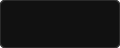
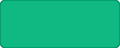
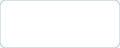
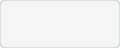
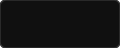
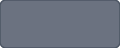
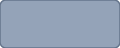

# 🎨 Design System

### Flow Studio – Clean, Simple, Productive.
This document defines the visual design system, UI components, and user experience guidelines for the Flow Studio application. The goal is to create a modern, minimal, and designer-friendly interface with a consistent look and feel across all pages.

---

### Table of Contents
1. [Design Principles](#1-design-principles)
2. [Color Palette](#2-color-palette)
3. [Typography](#3-typography)
4. [UI Components](#4-ui-components)
   - [4.1 Buttons](#41-buttons)
   - [4.2 Input Fields & Selects](#42-input-fields--selects)
   - [4.3 Cards & Containers](#43-cards--containers)
   - [4.4 Badges & Status Pills](#44-badges--status-pills)
   - [4.5 Alerts & Toasts](#45-alerts--toasts)
   - [4.6 Navigation & Tabs](#46-navigation--tabs)
   - [4.7 Avatars & Team Indicators](#47-avatars--team-indicators)
5. [Icons](#5-icons)
   - [5.1 Icon Library](#51-icon-library)
   - [5.2 Usage Guide](#52-usage-guide)
6. [Layout & Spacing](#6-layout--spacing)
   - [6.1 Spacing Scale](#61-spacing-scale)
   - [6.2 Grid System](#62-grid-system)
   - [6.3 Container Widths](#63-container-widths)
7. [Responsive Design](#7-responsive-design)
   - [7.1 Breakpoints](#71-breakpoints)
   - [7.2 Adaptive Desktop Strategy](#72-adaptive-desktop-strategy)
8. [Page Templates](#8-page-templates)
   - [8.1 Dashboard Layout](#81-dashboard-layout)
   - [8.2 Project Workspace & Pill Navigation](#82-project-workspace--pill-navigation)
   - [8.3 ClickUp-Style Task Table](#83-clickup-style-task-table)
9. [Illustrations & Graphics](#9-illustrations--graphics)
10. [Animation & Interaction](#10-animation--interaction)
    - [10.1 Transitions](#101-transitions)
    - [10.2 Hover States](#102-hover-states)
    - [10.3 Loading States & Skeletons](#103-loading-states--skeletons)
11. [Theming Scope](#11-theming-scope)

---

## 1. Design Principles

| Principle | Icon | Description |
|:---|:---:|:---|
| **User-Centered** | 🎯 | Simple and intuitive for creative designers, agencies, and studio leads. |
| **Minimal & Clean** | 🌿 | Reduce clutter and visual noise to focus 100% on creative content and tasks. |
| **Consistent** | 🧱 | Follow a unified Cal.com + ClickUp design token system across all views. |
| **Accessible** | ♿ | High-contrast monochrome typography, readable line heights, and WCAG AA compliance. |
| **Responsive** | 📱 | Works seamlessly on ultra-wide desktop monitors, laptop screens, and tablet viewports. |

---

## 2. Color Palette

Primary colors used across the application:

### Visual Palette Swatches

| Primary | Accent / Link | Success | Warning | Error / Urgent | Canvas | Surface Card | Dark Floor | Muted Text |
| :---: | :---: | :---: | :---: | :---: | :---: | :---: | :---: | :---: |
|  |  |  |  |  |  |  |  |  |
| **`#111111`** | **`#1978e5`** | **`#10b981`** | **`#f59e0b`** | **`#ef4444`** | **`#ffffff`** | **`#f5f5f5`** | **`#101010`** | **`#6b7280`** |
| Primary CTAs | Brand Links | Completed | Review Stage | Overdue Alerts | Main Floor | Card Bodies | Deep Footer | Secondary Text |

---

### Detailed Color Token Specification

| Token Name | Hex Code | Swatch | Usage & Description |
|:---|:---|:---:|:---|
| **Primary** | `#111111` |  | Primary CTAs, active pills, active states. **Decision (2026-09-25): the app's main theme is monochrome** — `primary` owns the action layer. |
| **Primary Active** | `#242424` |  | Button press state and hover feedback. Matches `--color-primary-hover` in `@theme`. |
| **Accent (Blue)** | `#1978e5` |  | Inline links, icon tints, selection rings, focus, focal badges. **Blue is the accent — never the primary CTA.** Matches `--color-accent` in `@theme`. |
| **Success** | `#10b981` |  | Completed tasks, active client status, paid invoice badges |
| **Warning** | `#f59e0b` |  | Review stage, approaching deadlines, stagnant lead warnings |
| **Error / Urgent** | `#ef4444` |  | Overdue deliverables, destructive delete actions, error alerts |
| **Background / Canvas** | `#ffffff` |  | Main application floor, white card bodies, spreadsheet cells |
| **Surface Soft** | `#f8f9fa` |  | Secondary buttons, nav-pill-group track, soft containers |
| **Surface Card** | `#f5f5f5` |  | Inactive cards, modal containers, pastel badge fills |
| **Surface Dark** | `#101010` |  | Terminal footer surface, featured dark cards, splash backdrop |
| **Hairline Border** | `#e5e7eb` |  | 1px border tone across inputs, cards, dividers, and popovers |
| **Text Primary (Ink)** | `#111111` |  | Main headline copy, modal titles, high-contrast labels |
| **Text Secondary (Body)**| `#6b7280`|  | Running body paragraphs, dates, breadcrumbs, column headers |

> **Resolved — one monochrome action layer, one blue accent.** The app's main theme is **monochrome** (`Primary` `#111111`) with **blue as the accent** (`#1978e5`). The former documented `Brand Accent` `#3b82f6` is **retired from the spec**: in code, `--color-primary` now carries monochrome ink (CTAs, active states) and `--color-accent` carries blue (links, icon tints, rings, selection).
>
> **Rule of thumb:** if a user clicks it and it commits an action, it is `primary` (monochrome). If it draws attention, links, or indicates selection/focus, it is `accent` (blue).
>
> **Dark-surface exception.** `primary` (`#111111`) has no contrast against dark chrome (the `bg-slate-950` bulk-action toolbars, the permanently-dark Copilot panel). There the action layer **inverts to white**: `bg-white hover:bg-white/90 text-black`. Blue does *not* return to the action layer on dark surfaces — `accent` stays reserved for count badges, selection and status, which is why the selection-count badge in those toolbars is `bg-accent text-white` while the buttons beside it are white.
>
> **Tone ramps are not collapsible.** `accent` is a single value, so it cannot express a *scale*. Where a hue is used as ordered steps it stays a ramp, because flattening it destroys the encoding: the Time Activity calendar uses four steps to mean "how busy was this day" (that one is written as `bg-accent/20 → /80`, so it is a ramp *and* a token), and the Revenue Summary card uses a range of darker blues for its 10px labels because `accent` `#1978e5` only manages 4.0:1 on that card's `#d4e4ff` fill — under the 4.5:1 floor for small text. **A pastel-filled card therefore keeps a tone ramp of its own hue; it does not take `accent`.**
>
> **⚠️ Settled in the spec, not yet true in the code.** `--color-accent` is presently the *token* blue only. The codebase still contains **334 raw Tailwind `blue-*` utilities across 55 files**, so the app still ships **two blues in practice** — the token `#1978e5` and Tailwind's `#2563eb`. Consolidating the rest onto `accent` is Phase 1 work; **Clients (116 sites) and Leads (108 sites) are migrated** as of 2026-09-26. The 10 surviving `#3b82f6` references are all **data**, not UI — the moodboard shape/stroke palettes, the task-status colour config, and category dots — and are in scope for the "intentional flag/status map" exception. Until the remaining groups land: **do not add new `blue-*` utilities** — use `accent`.

---

### Priority Flag Accents

| Priority | Hex Code | Visual Swatch | Behavior & Usage |
|:---|:---:|:---:|:---|
| **Urgent** | `#f04f5e` |  | Solid vibrant red flag for critical blockers & urgent deliverables |
| **High**   | `#f5a133` |  | Vivid orange flag for high-priority milestone items |
| **Normal** | `#3ba2f7` |  | Crisp sky blue flag for standard workflow tasks |
| **Low**    | `#94a3b8` |  | Neutral slate gray flag for low-urgency backlog tasks |

---

## 3. Typography

We use **Inter** and **Cal Sans / Geist** as primary typefaces for a clean and modern look.

```text
Aa  Inter / Cal Sans
    Clean, modern and highly readable geometric typography
```

| Element | Size | Weight | Line Height | Tracking | Purpose |
|:---|:---|:---|:---|:---|:---|
| **H1 (Display XL)** | 48px / 64px | 600 | 1.10 | `-1.5px` | Primary page title and hero statements |
| **H2 (Display MD)** | 32px / 36px | 600 | 1.15 | `-1.0px` | Section titles, dashboard greetings |
| **H3 (Title LG)**   | 20px / 24px | 600 | 1.30 | `-0.3px` | Card headers, modal titles |
| **Body (Body MD)**   | 16px | 400 | 1.50 | `0` | Running notes, descriptions, form inputs |
| **Small (Body SM)**  | 14px | 400 / 500 | 1.40 | `0` | Spreadsheet table cells, task titles |
| **Caption (Micro)**  | 12px / 13px | 500 / 600 | 1.30 | `+0.5px` | Badges, tags, UPPERCASE column headers |

---

## 4. UI Components

Standard components to be used throughout the application:

### 4.0 Radius Scale (single source of truth)

Measured across `src/` on 2026-09-26: `rounded-xl` 549, `rounded-lg` 381, `rounded-md` 209, `rounded-2xl` 189. Four competing radii with no stated rule is itself a consistency smell, so the scale is now explicit:

| Radius | Use for |
|---|---|
| `rounded-full` | Pills, tabs, avatars, circular icon buttons, badges |
| `rounded-md` | Small inline surfaces: table-cell highlights, skeletons, chips |
| `rounded-lg` | Buttons, inputs, selects — the standard control radius |
| `rounded-xl` | Cards, panels, popovers, dropdown menus |
| `rounded-2xl` | Large containers: modals, hero/summary cards, the credit-card flip panel |
| `rounded-3xl` | Top-level bento/section containers only |

Anything outside this table is a defect. A new radius requires a new row here first.

### 4.1 Buttons
* **Primary Button:** Solid dark fill (`bg-[#111111] text-white hover:bg-[#242424] active:scale-95 px-4 py-2 rounded-lg text-sm font-semibold transition-all`).
* **Secondary Button:** White surface with hairline border (`bg-white text-[#111111] border border-slate-200 hover:bg-slate-50 px-4 py-2 rounded-lg text-sm font-medium transition-all`).
* **Destructive Button:** Red accent button (`bg-red-50 text-red-600 hover:bg-red-100 border border-red-200 px-4 py-2 rounded-lg text-sm font-medium`).
* **Icon Button (Circular):** Circular 36x36px button (`w-9 h-9 rounded-full flex items-center justify-center border border-slate-200 hover:bg-slate-100`).

### 4.2 Input Fields & Selects
* **Text Input:** White canvas background, 1px border (`bg-white border border-slate-200 text-slate-900 rounded-lg px-3.5 py-2 text-sm focus:border-slate-900 focus:ring-1 focus:ring-slate-900 outline-none`).
* **Custom Select (`CustomSelect.tsx`):** Headless select dropdown with Framer Motion menu animations and rounded-xl corners.

### 4.3 Cards & Containers
* **Standard Content Card:** Clean white card (`bg-white border border-slate-200/90 rounded-xl p-6 shadow-sm hover:shadow-md transition-shadow`).
* **Surface Card:** Light gray utility container (`bg-[#f5f5f5] rounded-xl p-5 border border-slate-200/50`).

### 4.4 Badges & Status Pills
* **Pill Badges:** Fully rounded status indicators (`rounded-full px-3 py-1 text-xs font-medium border`).
  * *Active / Success:* `bg-emerald-50 text-emerald-700 border-emerald-200`
  * *Review / Warning:* `bg-amber-50 text-amber-700 border-amber-200`
  * *Draft / Neutral:* `bg-slate-100 text-slate-700 border-slate-200`

### 4.5 Alerts & Toasts
* **Notification Toast:** 60FPS dynamic height card with GPU translation (`transform: translateZ(0)`), border-l-4 semantic accent, dismissible close button, and auto-dismiss timer.

### 4.6 Navigation & Tabs
* **Cal.com Nav-Pill-Group:** Symmetric 1px border pill wrapper preventing layout shifting:
  * Inactive: `border border-transparent text-slate-600 hover:text-slate-900 px-4 py-1.5 rounded-full text-xs font-medium`
  * Active: `bg-slate-950 text-white border border-slate-950 px-4 py-1.5 rounded-full text-xs font-semibold shadow-sm`

### 4.7 Avatars & Team Indicators
* 36px perfect circle (`rounded-full`) displaying high-resolution photos or two-letter initials backed by subtle pastel fills (`bg-slate-100 text-slate-800 text-xs font-semibold`).

---

## 5. Icons

### 5.1 Icon Library
* **Primary:** `lucide-react` (Clean geometric SVG stroke icons).
* **Secondary:** Google Material Symbols (Used contextually for specific data manipulation arrows and drag indicators).

### 5.2 Usage Guide
* Standard icon size: `16x16px` (`w-4 h-4`) inside table rows and buttons; `20x20px` (`w-5 h-5`) in navigation sidebars.
* Icons must always align vertically with text labels using flexbox `items-center gap-2`.

---

## 6. Layout & Spacing

### 6.1 Spacing Scale
Base unit: **4px**
* `xxs`: 4px · `xs`: 8px · `sm`: 12px · `md`: 16px · `lg`: 24px · `xl`: 32px · `2xl`: 48px · `section`: 96px.

### 6.2 Grid System
* 12-column responsive layout for dashboard and project overview grids.
* Flexible 3-up desktop card flow collapsing to 2-up on tablet and 1-up on mobile.

### 6.3 Container Widths
* **Dashboard / Main View:** Fluid edge-to-edge max width ~1400px.
* **Onboarding Wizard & Modals:** Standardized `max-w-4xl` and `max-w-5xl` centered dialogs.

---

## 7. Responsive Design

### 7.1 Breakpoints
| Name | Min Width | Key Behavior |
|:---|:---|:---|
| **Mobile** | `< 768px` | Sidebar collapses to drawer; tables switch to horizontal scroll |
| **Tablet** | `768px – 1024px` | 2-column card grids; compact pill tabs |
| **Desktop**| `1024px – 1440px` | Full navigation sidebar, 3-column project galleries |
| **Wide**   | `> 1440px` | Maximum content density, expanded split drawers |

### 7.2 Adaptive Desktop Strategy
Flow Studio is optimized first as a high-density desktop workstation with adaptive sidebars that collapse to maximize screen space for the infinite canvas moodboard.

---

## 8. Page Templates

### 8.1 Dashboard Layout
Top greeting header with quick actions, KPI metric cards, Recharts activity visualization, and split view for active projects and contract renewals.

### 8.2 Project Workspace & Pill Navigation
Persistent project control header, Cal.com pill tabs switcher, and animated `<AnimatePresence>` view swaps between Overview, Tasks, Files, Notes, and Moodboard.

### 8.3 ClickUp-Style Task Table
Borderless data grid with status group headers, row isolation highlights on hover, inline text editing, flag priority selectors, and dual-column due date calendars.

---

## 9. Illustrations & Graphics

* **Aesthetic:** Minimalist monochrome line art and high-density SVG schematics.
* **No Generic Stock Vectors:** We avoid cartoonish illustrations in favor of real UI chrome fragments, vector swatches, and clean typography specimens.

---

## 10. Animation & Interaction

### 10.1 Transitions
* Page tab swaps: `initial={{ opacity: 0, y: 8 }}`, `animate={{ opacity: 1, y: 0 }}`, `exit={{ opacity: 0, y: -8 }}`, `transition={{ duration: 0.15 }}`.

### 10.2 Hover States
* Spreadsheet cells: Soft `ring-1 ring-slate-300/80 bg-slate-50/40 rounded-md` highlight box on hover.
* Interactive buttons: Smooth `hover:bg-slate-100 active:scale-95` tactile depression.

### 10.3 Loading States & Skeletons
* Pulse skeleton loaders matching exact table row dimensions (`animate-pulse bg-slate-100 rounded-md`) prevent layout reflow during store hydration.

---

## 11. Theming Scope

**Light theme only.** Flow Studio ships a single light theme. Dark mode is deliberately out of scope.

Do not add:
* `.dark` variants or `dark:` utility classes for product UI
* Dark surface tokens (`--color-background-dark`, `--color-surface-dark`, `--color-border-dark`)
* Theme-switching UI or a dark-mode setting

Note: the AI Copilot chat panel is a permanently dark *component*, not a theme. Its dark styling is intentional and local to that panel — it is not a theming system and must not be generalised.

`src/index.css` `@theme` is the single source of palette tokens. Any change to the palette belongs there, and the token names must stay in sync with §2 above.
