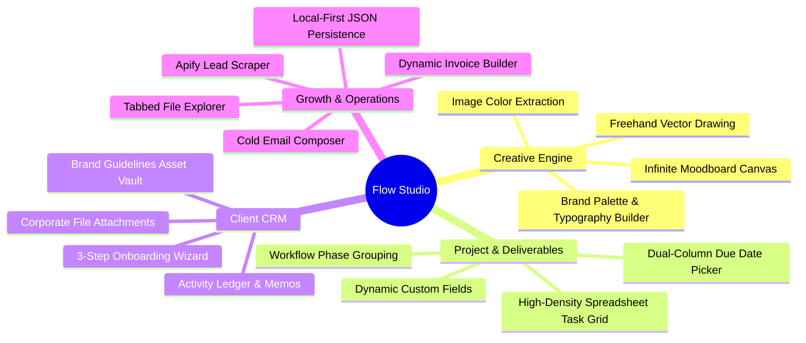

# Product Requirements Document (PRD)

### Flow Studio – All-in-One Design, Moodboard & Project Management Desktop Suite

| Metadata | Details |
|:---|:---|
| **Version** | 1.0.0 |
| **Date** | September 20, 2026 |
| **Author** | Labib Mustafa / Flow Studio Team |
| **Status** | Approved / Active Development |
| **Target Launch** | MVP (v1.0.0 Desktop Suite) |

---

### Table of Contents
1. [Product Overview](#1-product-overview)
2. [Problem Statement](#2-problem-statement)
3. [Goals](#3-goals)
4. [Target Users](#4-target-users)
5. [Core Features (MVP)](#5-core-features-mvp)
6. [User Personas & Journeys](#6-user-personas--journeys)
7. [Non-Functional Requirements](#7-non-functional-requirements)
8. [Technical Architecture & Data Privacy](#8-technical-architecture--data-privacy)
9. [Success Metrics (KPIs)](#9-success-metrics-kpis)
10. [Future Roadmap & Beyond MVP](#10-future-roadmap--beyond-mvp)

---

## 1. Product Overview

Flow Studio is a fast, local-first hybrid desktop workstation built for designers, creative directors, and boutique agencies. It unifies the creative process—from visual brainstorming on an infinite 2D canvas to structured project execution, ClickUp-style task tracking, Cal.com-inspired client CRM management, multi-platform lead generation, and dynamic PDF invoicing—all within a single, private, offline-first application.

The application runs locally on Windows and macOS powered by React 19, TypeScript, Electron, and Express, storing all project data as plain, human-readable JSON files directly on the user's computer (`~/Documents/FlowStudio-Data/`).

---

## 2. Problem Statement

Modern creative designers and agency teams suffer from severe operational friction:
* **Tool Fragmentation:** Creatives constantly switch between Figma/Milanote for visual moodboards, ClickUp/Notion for task management, HubSpot/Airtable for CRM, Apify/LinkedIn for lead generation, and QuickBooks for invoicing.
* **Context Disconnection:** Creative ideation (colors, references, typography) is detached from project execution (deadlines, checklists, deliverables).
* **Cloud Lock-in & Privacy Loss:** Client brand assets, confidential proposals, and project contracts are stored on proprietary cloud servers vulnerable to outages, data breaches, and recurring monthly subscriptions.
* **Latency & Clutter:** Web-based creative and management tools are often bloated, heavy, and sluggish, lacking the responsiveness needed for high-speed workflows.

---

## 3. Goals

* **Provide a Unified Creative Hub:** Integrate visual moodboarding directly alongside high-density task lists and CRM databases in a single window.
* **Guarantee 100% Data Sovereignty:** Give users total ownership of their data through local JSON file storage with zero mandatory cloud sync.
* **Deliver Instantaneous 60FPS UI:** Provide sub-50ms render interactions, smooth canvas zooming, and layout-jitter-free tab transitions.
* **Streamline the Client Lifecycle:** Support the full agency lifecycle from lead scraping, cold emailing, client onboarding, brand kit creation, task delivery, to invoice generation.

---

## 4. Target Users

* **Independent Brand & UI/UX Designers:** Freelancers who need an organized workspace for visual inspiration, client guidelines, and invoice management.
* **Boutique Creative Agencies (2–10 members):** Small teams needing shared project overviews, task assignments, and lead generation without paying expensive per-seat SaaS fees.
* **Design Directors & Art Consultants:** Professionals curating visual taste, typography pairings, and color palettes while tracking delivery timelines.
* **Demographics:** Age group 20–45, tech-savvy, values privacy, aesthetic minimalism, and keyboard-driven productivity.

---

## 5. Core Features (MVP)

### 5.1 Infinite Moodboard Canvas
* Infinite 2D pan and zoom canvas (10% to 500%) with hardware-accelerated GPU matrix transformations.
* Multi-card support: Image references with instant palette extraction (`sharp` / `tinycolor2`), color chips with HEX copy, sticky notes, typography preview cards, and web bookmarks.
* Manipulation tools powered by `react-moveable` and `react-selecto` with aspect-ratio locking, 8-point resizing, rotation, and layer stacking (Z-index controls).
* Freehand SVG vector drawing overlay with stroke smoothing and color selection.

### 5.2 Project & Task Management (ClickUp Style)
* Frameless edge-to-edge spreadsheet layout with interactive inline cell editing (`TaskList.tsx`).
* Phase grouping (`TO DO`, `IN PROGRESS`, `REVIEW`, `DONE`) with drag-and-drop task transfer.
* Priority flags: Urgent (`#f04f5e`), High (`#f5a133`), Normal (`#3ba2f7`), Low (`#94a3b8`), and Cleared.
* Dual-column due date popover combining quick presets (Today, Tomorrow, Next Week) with an interactive 7-day grid monthly calendar.
* Dynamic custom fields: Dropdown, Text, Date, Number, and Checkbox with sliding `FieldsSidebar.tsx`.
* Task Manifesto modal for deep assignments, subtask checklists, and multi-cloud file attachments.

### 5.3 Client CRM & Brand Database
* Searchable corporate directory cards with live status dots (Active, Prospect, Inactive) and star ratings.
* 3-Step Client Onboarding Wizard:
  1. *Client Basics:* Company identity, industry, avatar selector/presets, project budget.
  2. *Contact & Presence:* Contact emails, social presence, and sliding `ManageTagsSidebar.tsx`.
  3. *Style & Taste:* Interactive color palette sculptor and live typography font autocomplete.
* Dedicated client workspace (`ClientDetailsPage.tsx`) with Cal.com-inspired monochrome tabs.
* Quick Action FAB menu: Book appointments, create invoices, write notes, schedule tasks, and attach contract agreements.

### 5.4 Leads Pipeline & Apify Scraper
* Spreadsheet-accurate leads grid with inline cell editing (`InlineEditCell.tsx`) and dynamic column resizing.
* Weighted pipeline financial forecasting based on conversion stages (`New`, `Contacted`, `Proposal`, `Won`, `Lost`).
* Automated stagnant lead visual warning tags (>14 days inactive).
* Apify-powered multi-platform lead discovery (Google Maps, Instagram, LinkedIn).
* Cold email composer with template variables (`{name}`, `{company}`) and Nodemailer SMTP dispatch.
* One-click "Promote Lead to Client" workflow.

### 5.5 Tabbed File Explorer
* Windows-style multi-tab file explorer (`TabbedFileExplorer.tsx`) with path breadcrumbs, back/forward history, and address bar.
* Native file operations: Drive listing, folder navigation, rename, recycle bin deletion, and launching in OS default applications.
* Instant inline preview for images (PNG, JPG, SVG), PDFs, and text/markdown files.

### 5.6 Billing, Dynamic Invoicing & Payments
* Dynamic invoice builder with automatic subtotal, tax calculation, discount deductions, and client auto-fill.
* Pixel-perfect PDF exports generated client-side via `html2pdf.js` and `html2canvas-pro`.
* Financial settlement history and receivable tracking.

### 5.7 Operations: Dashboard, Calendar, Time Tracking & Reports
* Executive dashboard featuring Recharts activity graphs, contract renewal schedules, and KPI stat cards.
* Interactive calendar for scheduling tasks, client deliverables, and milestones.
* Billable hours time tracker tied directly to project tasks.
* Agency report generation covering revenue and delivery velocity.

### 5.8 AI Design & Project Co-Pilot
* Autonomous assistant following the strict `AGENTS.md` protocol.
* Workflow A: Read, analyze, and summarize project notes into Executive Design Briefs.
* Workflow B: Convert briefs and client feedback into structured tasks with valid priorities and phases.
* Workflow C: Curate visual inspiration and populate the Moodboard with non-overlapping elements.

---

## 6. User Personas & Journeys

### Persona A: Independent Brand Designer (Elena)
1. **Discovery:** Elena opens Flow Studio, launches the 3-step Onboarding Wizard, and sets up a new client profile.
2. **Ideation:** Opens the project Moodboard, pastes URL inspiration references, extracts a 5-color brand palette, and tests typography pairings.
3. **Execution:** Converts project discovery notes into actionable tasks on the ClickUp-style Task List.
4. **Billing:** When milestones are reached, Elena generates and exports a clean PDF invoice with one click.

### Persona B: Agency Creative Lead (Marcus)
1. **Acquisition:** Marcus scrapes local luxury retailers using the Apify Google Maps generator, drafts personalized cold emails, and manages the Leads Pipeline.
2. **Operations:** Once a lead accepts, Marcus converts the lead to a client, initializes the project template, and assigns team members.
3. **Monitoring:** Checks the Executive Dashboard daily to track velocity scores and upcoming contract renewal deadlines.

---

## 7. Non-Functional Requirements

| Category | Requirement | Metric / Specification |
|:---|:---|:---|
| **Performance** | Moodboard Canvas Frame Rate | Constant 60 FPS during zooming, panning, and marquee selections with 200+ elements |
| **Responsiveness** | Tab & View Switching Latency | Sub-50ms transition with zero layout jitter using Framer Motion |
| **Data Sovereignty** | Local-First Storage | All data stored on user's hard drive (`~/Documents/FlowStudio-Data/`); zero mandatory internet required |
| **Startup Speed** | App Launch Time | Sub-1.5s from splash screen to interactive Dashboard |
| **Memory Footprint** | Resting RAM Usage | Under 300MB RAM in resting desktop state |
| **Security** | Sandboxed Desktop Execution | Strict Electron context isolation (`nodeIntegration: false`, sanitized IPC channels) |

---

## 8. Technical Architecture & Data Privacy

* **Desktop Shell:** Electron 43 with dual-process architecture (`main.cjs` + `preload.cjs`).
* **Frontend:** React 19, TypeScript 5.8, Tailwind CSS 4, Vite 6, Zustand 5.
* **Micro-Backend:** Node.js Express server on port 3010 (`server.ts`) for local JSON file writes and email transport.
* **Data Storage:** Human-readable JSON files in `~/Documents/FlowStudio-Data/` and `%APPDATA%/FlowStudio/`.
* **Zero Telemetry:** No user activity, client assets, or financial data is transmitted to external telemetry servers.

---

## 9. Success Metrics (KPIs)

* **100% Data Integrity:** Zero data corruption or state loss across 10,000 continuous local file save cycles.
* **95%+ User Task Efficiency:** Users can create a project, moodboard, and task list in under 3 minutes.
* **Zero Layout Shift (CLS):** Cal.com pill tabs maintain 0px layout reflow across all active/hover state transitions.
* **100% Offline Capability:** Core ideation, task management, CRM, and invoicing remain fully operational without internet.

---

## 10. Future Roadmap & Beyond MVP

* **v1.1:** Real-time local network (P2P / WebRTC) team sync for multi-designer local collaboration.
* **v1.2:** Native AI canvas generation using Google Gemini `@google/genai` to auto-generate color palettes and layout mockups.
* **v1.3:** iOS & iPadOS companion viewer for client review and moodboard presentation mode.
* **v1.4:** Extended plugin marketplace for custom scrapers and external cloud backups (Google Drive, Dropbox).
