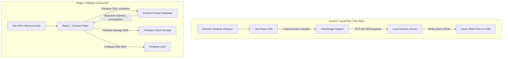

# Firebase Cloud Migration Plan for Flow-Studio

This document outlines the end-to-end technical plan to migrate Flow-Studio from a **local-first, file-synced desktop application** to a **multi-user cloud platform** powered by Google Firebase. 

This migration resolves current race-condition conflicts (data overwrites) and scales the application to support 10+ concurrent users safely, with real-time updates and cloud authentication.

---

## 1. Architectural Transition Comparison



| Component | Current Local Architecture | Target Firebase Cloud Architecture |
| :--- | :--- | :--- |
| **Authentication** | Firebase SDK configured but only for Google Auth verification | Full Firebase Auth (Sessions, persistent login state, user profiles) |
| **Database** | Stateful JSON files read/written as whole arrays via Express | **Google Firestore** (NoSQL Document Database) |
| **Media/Assets** | Local Express `/api/assets` endpoints (writing to local disk) | **Firebase Cloud Storage** (for banners, profile pictures, and documents) |
| **Concurrency** | **None** (Last-write wins; overwrites entire lists) | **Built-in Document Locking** (Concurrent reads/writes at document level) |
| **Hosting** | Local Node server (`localhost:3000`) inside Electron wrapper | **Firebase Hosting** (Frontend SPA) + Cloud functions (Backend triggers) |

---

## 2. Step 1: Firebase Data Model (Firestore Schema)

Instead of saving monolithic arrays (e.g., all clients in `clients.json`), we will decompose each Zustand store into a Firestore collection, where **each item is a single document**.

### Collections & Document Schemas

#### Collection: `clients`
*   **Document ID:** Unique hash or client slug (e.g. `client_acme_123`)
```json
{
  "name": "Acme Corp",
  "company": "Acme Industries",
  "role": "Premium Client",
  "status": "Active",
  "email": "contact@acme.com",
  "phone": "+1 555-0199",
  "location": "New York, USA",
  "totalVolume": 125000,
  "outstandingAmount": 4500,
  "socialProfiles": [
    { "platform": "twitter", "url": "https://twitter.com/acme" }
  ],
  "brandColors": [
    { "name": "Primary Blue", "hex": "#2563eb" }
  ],
  "avatarUrl": "https://firebasestorage.googleapis.com/.../avatars/acme.png",
  "tags": ["enterprise", "tech"],
  "updatedAt": "timestamp"
}
```

#### Collection: `tasks`
*   **Document ID:** `task_xyz456`
```json
{
  "title": "Design new dashboard mockup",
  "description": "Create desktop and mobile variations.",
  "status": "In Progress",
  "priority": "High",
  "dueDate": "2026-08-01T00:00:00.000Z",
  "assigneeId": "member_johndoe",
  "clientId": "client_acme_123",
  "projectId": "project_alpha_789",
  "createdAt": "timestamp"
}
```

#### Other Collections to Create:
*   `projects`: Tracks project metadata, due dates, and statuses.
*   `team`: Member details (profilePicUrl, bannerUrl, role, active focus, bio).
*   `leads`: Sales pipelines and client interaction histories.
*   `mail`: Synchronized mail drafts, templates, and outbound queues.
*   `notes`: Client notes and feedback logs.

---

## 3. Step 2: Refactoring Zustand Stores

Currently, Zustand stores use the `createFileStorage` adapter to save the state to local files. We will strip this out and replace it with **Firestore Real-time Subscriptions (`onSnapshot`)** and **individual document mutation actions**.

### Migration Example: `clientStore.ts`

#### Before (Local Array Syncing)
```typescript
export const useClientStore = create<ClientState>()(
  persist(
    (set) => ({
      clients: [],
      addClient: (clientData) => {
        set((state) => ({ clients: [...state.clients, newClient] }));
      }
    }),
    { name: 'client-storage', storage: createFileStorage('clients') }
  )
);
```

#### After (Firestore SDK Direct Syncing)
```typescript
import { db } from '../lib/firebase';
import { collection, addDoc, doc, updateDoc, deleteDoc, onSnapshot } from 'firebase/firestore';

export const useClientStore = create<ClientState>()((set, get) => ({
  clients: [],
  
  // Real-time synchronization callback (initialized on app load)
  subscribeClients: () => {
    return onSnapshot(collection(db, 'clients'), (snapshot) => {
      const clientsList = snapshot.docs.map(doc => ({
        id: doc.id,
        ...doc.data()
      })) as Client[];
      set({ clients: clientsList });
    });
  },

  addClient: async (clientData) => {
    const docRef = await addDoc(collection(db, 'clients'), {
      ...clientData,
      createdAt: new Date().toISOString()
    });
    return docRef.id;
  },

  updateClient: async (id, updates) => {
    const clientRef = doc(db, 'clients', id);
    await updateDoc(clientRef, updates);
  },

  deleteClient: async (id) => {
    await deleteDoc(doc(db, 'clients', id));
  }
}));
```

---

## 4. Step 3: File Uploads to Firebase Storage

Currently, files (avatars, cover banners, moodboard files) are uploaded via local endpoints that read/write to the server's local hard drive:
`fetch('/api/assets/upload', { ... })`

We will switch to the **Firebase Cloud Storage SDK** to perform direct client-side uploads, keeping uploads fast and serverless.

### Refactored Upload Handler

```typescript
import { getStorage, ref, uploadBytes, getDownloadURL } from 'firebase/storage';

const storage = getStorage();

export const uploadProfilePicture = async (userId: string, file: File): Promise<string> => {
  // Create a storage reference point
  const avatarRef = ref(storage, `avatars/${userId}-${file.name}`);
  
  // Upload raw bytes directly to Google Cloud Bucket
  const snapshot = await uploadBytes(avatarRef, file);
  
  // Retrieve public download URL to store in Firestore
  const downloadUrl = await getDownloadURL(snapshot.ref);
  return downloadUrl;
};
```

---

## 5. Step 4: Security Rules Configuration

To protect database files from unauthorized external tampering, set up Firebase Security Rules inside the Firebase Console.

```javascript
rules_version = '2';
service cloud.firestore {
  match /databases/{database}/documents {
    
    // Helper check: Verify user is authenticated
    function isAuthenticated() {
      return request.auth != null;
    }
    
    // Only logged-in users belonging to your workspace can read/write data
    match /{document=**} {
      allow read, write: if isAuthenticated();
    }
  }
}
```

---

## 6. Implementation Roadmap (5 Phases)

| Phase | Tasks | Target Timeline |
| :--- | :--- | :--- |
| **Phase 1: Setup** | 1. Initialize a new Firebase project.<br>2. Enable Firestore, Firebase Storage, and Google Authentication.<br>3. Populate credentials into `.env.production`. | Days 1–2 |
| **Phase 2: DB Schema** | 1. Write an ingestion script to read local `clients.json`, `tasks.json`, etc., and seed them as documents into Firestore.<br>2. Verify database records via the Firebase Console dashboard. | Days 3–4 |
| **Phase 3: Refactor Stores** | 1. Refactor `clientStore.ts`, `taskStore.ts`, and `teamStore.ts` to replace Zustand file persistence with real-time Firestore listeners.<br>2. Replace file saving with Firebase Storage. | Days 5–8 |
| **Phase 4: Functions** | 1. Move Node-specific local tasks (like SMTP/IMAP mail syncing from `server.ts`) to Firebase Cloud Functions.<br>2. Shut down the local Express API server. | Days 9–11 |
| **Phase 5: Deploy** | 1. Deploy the SPA frontend web code using Firebase Hosting.<br>2. Configure Electron distribution packages to read from the live Firebase production URL. | Days 12–14 |

---

> [!IMPORTANT]
> Since this app is wrapped in **Electron** (desktop wrapper), migrating to Firebase makes it a hybrid cloud app. Users will still open the same desktop Electron app, but their computers will communicate over the web directly with the Firebase database, ensuring they all view the same real-time data simultaneously.
